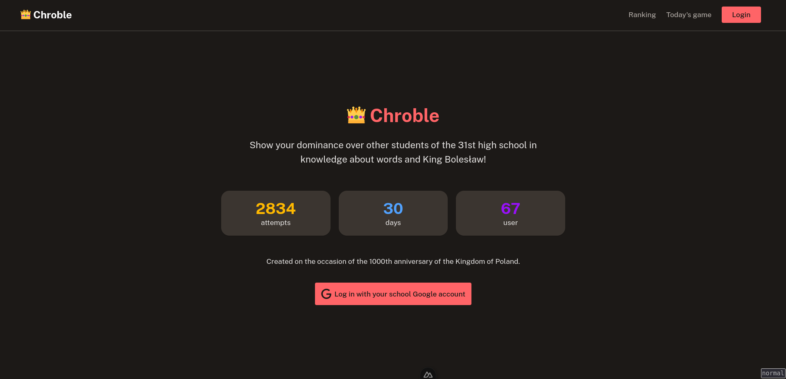
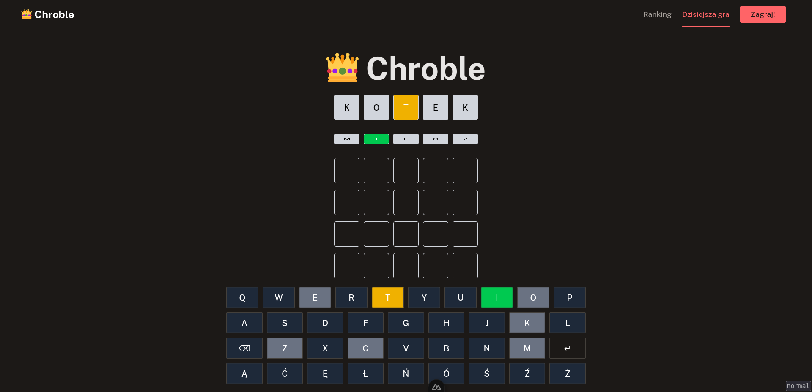

# 👑 Chroble

Simple wordle-like game for "1000-lecie Królestwa Polskiego" competition.

*Created on the occasion of the 1000th anniversary of the Kingdom of Poland.*

Made with [Nuxt](https://nuxt.com/docs/getting-started/introduction), [NuxtHub](https://hub.nuxt.com/) and [Nuxt UI](https://ui3.nuxt.dev).

## Development

Install all required dependencies

```bash
bun install
```

Start the development server on `http://localhost:3000`:

```bash
bun dev
```

Generate database migrations

```bash
bun run db:generate
```

# 🖼️ Screenshots


